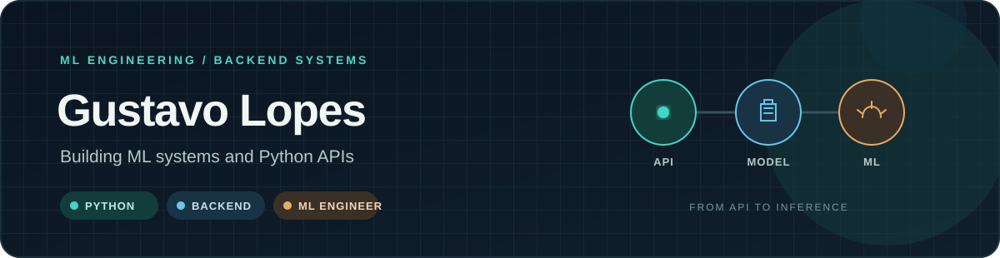

  <picture>
    <source media="(prefers-color-scheme: dark)" srcset="./assets/hero-dark.svg">
    <source media="(prefers-color-scheme: light)" srcset="./assets/hero-light.svg">
    
  </picture>

    

  
Computer Science graduate focused on backend applications and APIs with Python, Django, and FastAPI, with an academic background in Data Science and Machine Learning.

  

 

  <picture>
    <source media="(prefers-color-scheme: dark)" srcset="./assets/terminal-dark.svg">
    <source media="(prefers-color-scheme: light)" srcset="./assets/terminal-light.svg">
    
  </picture>

 

  

